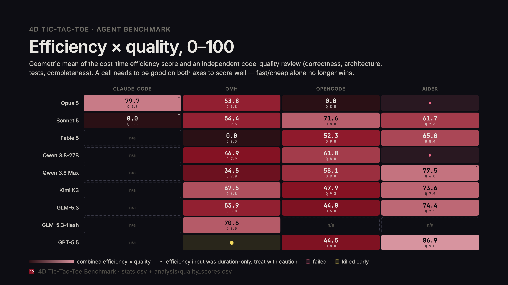

# 4D Tic-Tac-Toe agent comparison

27 harness/model combinations, same task each: build a complete browser-based 4D tic-tac-toe game on a 3x3x3x3 board, in Python, end to end. Same `TASK.md`, same baseline commit, same definition of done. We measure time, tokens, cost, tool usage and behavior.

Each run is an independent git repository seeded from an identical baseline. The agents work autonomously, we record everything they do.

## Test matrix

Legend: x = done and independently verified (tests run, server checked, or both), ✗ = failed (no usable deliverable), † = killed early (partial data only), blank = not a target for that harness. All 27 combinations are resolved.

|  | claude-code | omh | opencode | aider |
|---|---|---|---|---|
| **Opus 5** | x | x | x | ✗ |
| **Sonnet 5** | x | x | x | x |
| **Fable 5** |  | x | x | x |
| **Qwen 3.8-27B** |  | x | x | ✗ |
| **Qwen 3.8 Max** |  | x | x | x |
| **Kimi K3** |  | x | x | x |
| **GLM-5.3** |  | x | x | x |
| **GLM-5.3-flash** |  | x |  |  |
| **GPT-5.5** |  | † | x | x |

24 of 27 done, 1 killed, 2 failed.

`aider-opus` failed outright: model output incompatible with aider's `whole` edit format, even with an extended thinking budget. Not retried, this looks like a structural incompatibility between Claude Opus 5's response style and aider's edit format rather than a transient issue.

`aider-qwen` failed too, but it wasn't caught for a while. It sat marked done for weeks with no verification note in `stats.csv`, the only row that had none, until the code quality pass below actually tried to run it. `game.py`'s direction deduplication is broken: it produces 1820 crosses instead of 1548, trips the module's own sanity check, and crashes on import. Reproduced directly, `python3 -c "import game"` in that repo raises `RuntimeError`. It had previously scored 57.1 on the efficiency scale using real recovered cost data, that score just measured how cheaply a broken deliverable got produced, so it's gone now. This is the exact failure mode a harness with no shell execution can't catch on its own.

`oh-my-humanize-codex` was killed before it produced anything usable (gpt-5.5, 189s, partial data in `stats.csv`).

The last cell to resolve was `opencode-opus`. Its `stats.csv` row still described an early budget-walled attempt (0 commits) long after the run was reset, relaunched clean, and actually finished, about 3h56m and 4 real commits later. Caught by checking `git log` directly instead of trusting the stale note. Verified independently: 116/116 tests pass, server responds 200 on port 8421. It's also the single most expensive cell in the whole matrix ($36.66) and ships with no README.md and no requirements.txt anywhere in the repo, a direct violation of a named `TASK.md` deliverable, not just the usual TASK.md-committed hygiene slip seen elsewhere.

`opencode-sonnet`, `opencode-qwen-max`, and `opencode-glm-53` each finished their real work (implementation complete, tests self-reported passing) but got blocked by opencode's own sandbox denying `external_directory (/tmp/*)` during the final verification step, so they never reached `git commit`. I verified each deliverable myself (test suite rerun, server smoke-tested) and committed it on the agent's behalf, with the commit message documenting the rescue. `opencode-codex` hit a related but different issue: it stalled for 2+ hours mid-verification, most likely a foreground server-start call that never returned, and got resumed from its exact stalled state instead of reset.

A handful of "done" runs ship a test file with some failing tests that turned out, on inspection, to be bugs in the test rather than the game (asserting a win before the move was actually placed, or assuming a randomly filled board can be a draw when a draw is provably impossible on this board, see `claude-code-opus5`'s own SAT proof). This follows directly from harnesses without shell execution: the agent never runs its own tests, so a subtly wrong test ships right next to working code. See "Code quality" below for the full breakdown, including the cases where the test itself was genuinely broken and not just a false-negative draw check.

## Efficiency x quality score

Efficiency alone doesn't say whether a codebase is any good. A deliverable can be cheap and fast because it's genuinely lean, or because it's broken and never checked itself (`aider-qwen` above is exactly that). So the number shown per cell is the geometric mean of the cost-time efficiency score and the code quality score below, a cell has to be good on both axes to score well. Each cell also shows its quality score directly (`Q x.x`) so the two halves stay visible instead of disappearing into one blended number.

21 cells sit in the cost-aware efficiency group: omh, opencode, and 5 aider cells with recovered real cost, now including `opencode-opus`. `claude-code`'s two cells and `aider-qwen-max` are duration-only (marked with a dot) and not on the same scale, don't read those against the rest at face value. `aider-qwen` is excluded entirely: a cell only gets scored if it clears the definition-of-done gate, and a codebase that crashes on import doesn't.

`PNG`/`PPTX` source: `analysis/score-grid.png`, `analysis/score-grid.pptx`.

## Code quality

Efficiency measures how cheaply a cell reached a verified deliverable, not whether that deliverable is any good. All 24 done repos were independently reviewed against four dimensions, 0-10 each, by harness-grouped agents that read the actual game logic, AI/solver code and tests instead of trusting self-reported pass rates. `aider-qwen` doesn't appear below, it never cleared the gate.

- **Correctness**: does win detection actually cover all 1548 crosses, does the AI's immediate-win/block/optimal-endgame logic hold up when read, not just when tested
- **Architecture**: separation of concerns, naming, module structure, maintainability
- **Test quality**: does the suite test the right thing correctly. The board's mathematically impossible full draw (see the test matrix above) is a known, non-penalized false-negative pattern. A test that's wrong for any other reason (never places the mark it checks, checks legality instead of optimality, is internally tautological) is a real deduction
- **Completeness**: everything `TASK.md` requires, both play modes, coordinate/turn display, win highlighting, single-command startup, README accuracy, offline operation

| Run | Correctness | Architecture | Tests | Completeness | Quality | Efficiency | Combined |
|---|---|---|---|---|---|---|---|
| aider-codex | 9 | 9 | 9 | 9 | 9.0 | 83.9 | **86.9** |
| claude-code-opus5 | 9 | 9 | 9 | 9 | 9.0 | 70.5† | **79.7†** |
| aider-qwen-max | 8 | 8 | 3 | 5 | 6.0 | 100.0† | **77.5†** |
| aider-glm-53 | 8 | 8.5 | 6 | 7.5 | 7.5 | 73.9 | **74.4** |
| aider-kimi | 9 | 8.5 | 6 | 8 | 7.9 | 68.5 | **73.6** |
| opencode-sonnet | 9 | 9 | 8 | 9 | 8.8 | 58.3 | **71.6** |
| oh-my-humanize-ox-alpha | 8 | 9 | 9 | 8 | 8.5 | 58.6 | **70.6** |
| oh-my-humanize-kimi-k3 | 7 | 9 | 4 | 7 | 6.8 | 67.0 | **67.5** |
| aider-fable | 7.5 | 9 | 8 | 9 | 8.4 | 50.3 | **65.0** |
| opencode-qwen | 8 | 9 | 9 | 6 | 8.0 | 47.8 | **61.8** |
| aider-sonnet | 9 | 8 | 4 | 8 | 7.3 | 52.2 | **61.7** |
| opencode-qwen-max | 9 | 9 | 9 | 9 | 9.0 | 37.5 | **58.1** |
| oh-my-humanize-sonnet | 9 | 9 | 10 | 9 | 9.3 | 31.8 | **54.4** |
| oh-my-humanize-glm-53 | 9 | 9 | 9 | 8 | 8.8 | 33.0 | **53.9** |
| oh-my-humanize-opus | 10 | 9 | 10 | 10 | 9.8 | 29.5 | **53.8** |
| opencode-fable | 9 | 9 | 9 | 9 | 9.0 | 30.4 | **52.3** |
| opencode-kimi | 9 | 9 | 9 | 10 | 9.3 | 24.7 | **47.9** |
| oh-my-humanize-qwen38 | 7 | 9 | 6.5 | 9 | 7.9 | 27.9 | **46.9** |
| opencode-codex | 9 | 6 | 8 | 9 | 8.0 | 24.7 | **44.5** |
| opencode-glm-53 | 7 | 8 | 4 | 5 | 6.0 | 32.3 | **44.0** |
| oh-my-humanize-qwen-max | 6 | 8 | 8 | 9 | 7.8 | 15.3 | **34.5** |
| claude-code-sonnet | 9 | 9 | 8 | 9 | 8.8 | 0.0† | **0.0†** |
| oh-my-humanize-fable | 9 | 9 | 6 | 9 | 8.3 | 0.0 | **0.0** |
| opencode-opus | 9 | 9 | 10 | 4 | 8.0 | 0.0 | **0.0** |
| aider-qwen | 0 | 6 | 2 | 2 | 2.5, disqualified | removed | **removed** |

† efficiency half came from a duration-only comparison, not the cost-aware group, treat the combined number with extra caution. Combined = geometric mean of quality (rescaled to 0-100) and efficiency. Full source: `analysis/quality_scores.csv`.

Combining the two axes moves the leaderboard around, which is the point. `aider-qwen` is the whole reason this table exists: it scored 57.1 on efficiency alone with real recovered cost data, before this review caught that the app doesn't run. A cost/duration metric can't tell a lean deliverable from a broken one that failed fast, only running it can, so it's excluded rather than scored 0.

`aider-codex` tops the combined ranking outright at 86.9, the top efficiency score in the whole matrix and tied for top quality (9.0), not an artifact of missing data on either side.

`opencode-opus` is the clearest case of the efficiency floor's blind spot. It has the highest test-quality score in the dataset (10/10, every one of the 1548 crosses checked against two independent oracles) and correct AI logic throughout, but it's also the single most expensive cell in the entire matrix, nearly double the next priciest run, which floors its efficiency score to 0.0 by definition since the cheapest cell in a comparison group always scores 100 and the priciest always scores 0 regardless of margin. Its actual flaw is separate and shows up in completeness (4/10): no README.md, no requirements.txt anywhere in the repo. `oh-my-humanize-opus` shows the same expensive-but-good pattern without the floor effect, since it stays within its own harness's normal cost range instead of setting a new extreme: lowest efficiency in its harness (29.5) but the highest quality in the entire dataset (9.8), landing mid-table combined (53.8) instead of at either end, a fair result for correct but slow and pricey.

Duration-only cells cluster suspiciously high (`aider-qwen-max` at 77.5, `claude-code-opus5` at 79.7), precisely because their efficiency half was scored against a much smaller, less varied comparison group. That's what the dagger is for.

Three repos have real, reachable AI bugs, not just the known draw false negative. `oh-my-humanize-qwen-max`'s endgame solver can misclassify a safely blockable position as a forced loss, a direct violation of "never lose when a draw is available". `oh-my-humanize-kimi-k3` has a sign-inverted heuristic that fires on ordinary moves. `opencode-qwen` caches a fail-high search bound as if it were exact. None were caught by the runs' own test suites, and all three still cleared the completeness gate since the bug never surfaced in play.

Test quality is the sharpest differentiator, and it's more a harness story than a model story. `opencode-glm-53`'s flagship 1548-cross test fails deterministically, its filler cells can accidentally complete a different cross. Five of aider's seven working repos got the actual game logic right but shipped a test suite that doesn't pass end to end, consistent with aider having no shell execution to catch its own broken tests before finishing.

Missing README/requirements.txt shows up three times, all in self-verifying harnesses. `opencode-opus`, `opencode-qwen`, and `opencode-glm-53` all shipped working code with no README at all. A harness that can run its own tests apparently doesn't check whether it wrote the one plain-text deliverable `TASK.md` calls out by name.

## Launching a run

`./run.sh <target>` does the whole thing: sanity-checks the agent directory, launches the harness with the task prompt, and records the run into `stats.csv` when the harness exits.

- `./run.sh opus`: Claude Code, model `opus`, in `claude-code-opus5/`
- `./run.sh qwen`: omh, `openrouter/qwen/qwen3.8-27b`, in `oh-my-humanize-qwen38/`
- `./run.sh kimi`: omh, `openrouter/moonshotai/kimi-k3`, in `oh-my-humanize-kimi-k3/`
- `./run.sh opencode-qwen`: opencode, `openrouter/qwen/qwen3.8-27b`, in `opencode-qwen/`
- `./run.sh aider-qwen`: aider, `openrouter/qwen/qwen3.8-27b`, in `aider-qwen/`

Any target containing the name matches, e.g. `./run.sh qwen3.8-max`.

Flags: `--reset` restores the agent directory to its baseline before the run. `--dry-run` runs the sanity checks and prints the launch command without starting anything. `--new` scaffolds a fresh agent directory.

The model is pinned per target on purpose, a wrong default would silently change what you're benchmarking.

## Recording stats

`run.sh` fills `start_utc`, `end_utc`, `duration_s`, the token columns and `cost_usd` automatically when the harness exits (normal exit or Ctrl-C). The sources below are for cross-checking a row by hand.

### Claude Code (subscription)

- `/cost` inside the session shows input, output, cache-read and cache-write tokens plus an estimated cost. The dollar figure on a subscription is only a reference, so leave `cost_usd` empty and put the estimate in `notes` if you want it.
- Exact fallback: the session transcript is at `~/.claude/projects/<dir-slug>/<session>.jsonl`. Each assistant entry carries a `usage` object (`input_tokens`, `output_tokens`, `cache_creation_input_tokens`, `cache_read_input_tokens`). Sum those fields over the file for exact session totals.
- CSV mapping: `tokens_in` = input + cache writes, `tokens_out` = output, `tokens_cached` = cache reads. Use the same mapping for the OpenRouter runs.

### oh-my-humanize (OpenRouter)

- The activity page at openrouter.ai/activity is the source of truth. Filter by model name and by the run's time window, then sum the cost column into `cost_usd` and the token columns into `tokens_in`, `tokens_out`, `tokens_cached`.
- Programmatic alternative: `GET https://openrouter.ai/api/v1/generations` with your key returns per-request tokens, cost and `created_at`. Filter by model and window, sum with jq.
- If omh prints its own session usage summary at the end, take tokens from there and take the money from OpenRouter, since OpenRouter is what bills.

### opencode (OpenRouter)

- opencode stores per-message token usage in `~/.local/share/opencode/opencode.db` (SQLite). The collector reads it directly.

### aider (OpenRouter)

- aider writes `.aider.chat.history.md` in the project dir. `run.sh`'s live collector still can't get cost/tokens out of it, since the `session` total in aider's printed `Cost: $X message, $Y session` line resets every time `run.sh`'s retry loop reinvokes the CLI.
- Recoverable after the fact, though: the `message` figure on that same line is per-API-call and additive, it doesn't reset on reinvocation. `grep -E 'Tokens: .* Cost:' .aider.chat.history.md` and sum the `message` cost (plus the `sent`/`received` token counts) across every line in the file for a real total instead of just duration. This recovered real cost for 6 of the 8 completed aider runs. The other 2, `aider-opus` (failed before any message completed) and `aider-qwen-max` (history file didn't survive the workspace-budget incident), are still duration-only.

For cross-run comparison use `tokens_in`, `tokens_out` and wall-clock time. Claude Code reports cache reads and writes separately, OpenRouter folds caching into per-token prices, and `cost_usd` only exists for the OpenRouter rows unless you deliberately fill the subscription row with an API-priced reference.

## Known issues and operational fixes

Things that broke while running this benchmark, in case you hit them again.

- aider doesn't pick up `OPENROUTER_API_KEY` from the environment. `litellm.completion()` does, but aider 0.86.2's own key-resolution layer doesn't, so every aider call 401s with `"User not found"` unless the key is also passed explicitly via `--api-key openrouter=$OPENROUTER_API_KEY`. `run.sh` does this now.
- aider truncates long responses well under the model's real limit, and `--thinking-tokens` does not fix it. Without an explicit `max_tokens`, OpenRouter caps completions far below what the model actually supports (observed ~11K tokens on a 128K-capable model), and aider surfaces the cutoff as `"Model X has hit a token limit!"` with zero commits. `--thinking-tokens` only sets the separate extended-thinking budget, it does nothing for this. The fix is `.aider.model.settings.yml` in the project root, loaded via `--model-settings-file`, setting `extra_params.max_tokens` explicitly per model (128000 here, the real ceiling for these models). Same root cause reported upstream: [Aider-AI/aider#2169](https://github.com/Aider-AI/aider/issues/2169).
- omh needs a real TTY, even when launched unattended. Unlike aider's `--message` or opencode's `run` (both explicitly non-interactive), omh's default mode is a TUI and exits in ~1s if backgrounded without a pty. Wrap the launch in `script -q /dev/null` for a pty, and hold its stdin open on a pipe that never produces input or closes (`exec 3< <(sleep 999999)`). Without that second part it still reads EOF immediately and exits.
- OpenRouter model IDs can go stale. `qwen/qwen3.8-max` stopped resolving in opencode's live model lookup partway through this project (OpenRouter renamed it to the dated snapshot `qwen3.8-max-0902`), the same bare string still worked fine for aider/litellm and for omh. Check `curl https://openrouter.ai/api/v1/chat/completions` directly with a target model string before assuming a harness-specific failure.
- A shared OpenRouter key can have a workspace budget well below its own daily limit. Separate from the key's own `$250/day` cap (`GET /api/v1/auth/key` -> `limit`/`limit_remaining`), an OpenRouter workspace can have its own daily/weekly/monthly/lifetime spend cap (`usage_daily` crossing it returns 403 `"Workspace daily budget of $X exceeded. Contact your org admin"`). It hit every harness sharing the key (aider, opencode), not just one. Only an Organization Administrator can raise it, at `https://openrouter.ai/workspaces/<slug>/settings`. Enforcement was inconsistent right at the threshold, some concurrent runs kept working for a few minutes after others started failing, so don't assume everything is blocked the moment you see the error once.
- opencode's own sandbox can block a run right at the finish line. Several runs completed their real work, self-reported all tests passing, then failed every subsequent tool call with `permission requested: external_directory (/tmp/*); auto-rejecting`, usually while starting a server or `pip install`-ing a dependency for final verification, and so never reached `git commit`. Showed up on three separate models. If a run ends with a clean implementation but zero commits and this error in the log, the work is very likely fine, verify it by hand (run the tests, start the server) before deciding whether to commit it yourself or retry.
- `run.sh`'s own `EXIT` trap doesn't always fire promptly on `SIGINT`. If the harness is mid-call when the signal arrives, `stats.csv` can be left blank even though real, committed work already exists, check `git log` in the run's own directory before trusting an empty row. Separately, whatever launched `run.sh` in the background can itself outlive its own child process group as an orphaned `bash` stuck in `wait`, `ps aux | grep launch` before assuming a run is fully done.

## Analysis

- `analyze.py`: reads `stats.csv` and transcripts, produces `analysis/summary.md`, `analysis/metrics.csv`, and PNG plots.
- `semantic.py`: reads transcripts, computes behavioral metrics, and asks a small model for per-run profiles and a cross-run synthesis.
- `report.py`: generates the typst report (`report/report.pdf`) with figures and per-run deep dives.

Run order: `analyze.py`, then `semantic.py`, then `report.py`.
